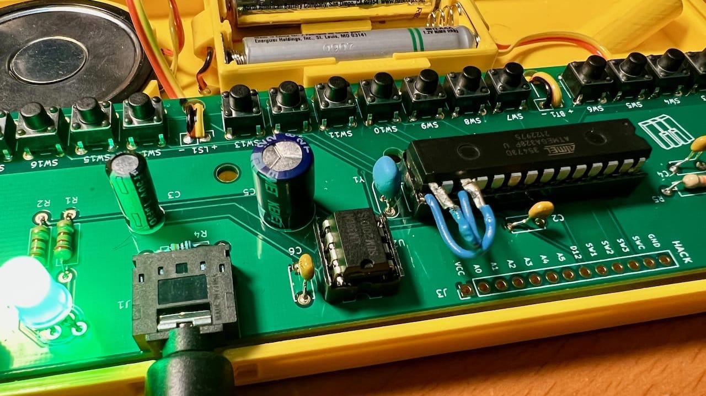

# MozziScout

Arduino sketches for Oskitone Scout using Mozzi synthesis library!

[Mozzi](https://sensorium.github.io/Mozzi/) is an audio synthesis library for Arduino
that can do multi-oscillator synthesis with filters and modulation on even an Arduino Uno.

[Oskiton Scout](https://oskitone.github.io/scout/) is an adorable tiny keyboard kit that is
based on an Arduino Uno.

This repo shows some exmaples of using Mozzi on Scout, along with the small mod needed to make it work.

## Sketches

- [mozziscout](mozziscout/) - a straight-forward Mozzi version of the 'scout' sketch that comes on Scout

- [mozziscout_poly](mozziscout_poly/) - a poly synth, sort of. Scout's keyboards doesn't allow true
playing of chords, but with a slow release envelope and the playing of arpeggios, you can make chords

- [mozziscout_wash](mozziscout_wash/) - a five-oscillator stacked chord sound based on the Mozzi example
[Control_Oscil_Wash](https://github.com/sensorium/Mozzi/blob/master/examples/02.Control/Control_Oscil_Wash/Control_Oscil_Wash.ino)

- [mozziscout_thx](mozziscout_thx/) - an eight-oscillator stacked sound where the oscillators start at a random pitch and slowly converge to a chord. Vagugely based on [THX Deep Note](https://en.wikipedia.org/wiki/Deep_Note)

## Demos

- mozziscout_poly:

https://user-images.githubusercontent.com/274093/145919492-d7a09c77-17af-4bb8-a2b9-0461dc5f6cd3.mp4

- mozziscout_thx:
 
https://user-images.githubusercontent.com/274093/145919518-16e2b630-6e01-47f0-af7d-57828377f685.mp4

## How to mod your Scout

MozziScout is just like a normal Scout, but pins 9 & 11 are swapped, so we can use Mozzi.
The Mozzi library uses pin 9 for audio, because that's on Timer1, a 16-bit timer.
However Scout uses the 8-bit Timer2 on pin 9. It's not easy to swap these two functions in code.

So to make Scout work with Mozzi, swap the functions of pins 9 & 11 physically!
Pin 9 is normally hooked up to the keyboard. Pin 11 is normally the audio out.
Arduino pins 9 & 11 are ATmega328 pins 15 & 17. (Pin 15  is thebottom-right pin if looking down on it, and Pin 17 is two up from that)

One way two swap this is where the two legs of the ATmega328 chip are lifted,
and jumper wires are soldered on and plugged into the socket, as in the photo below.

