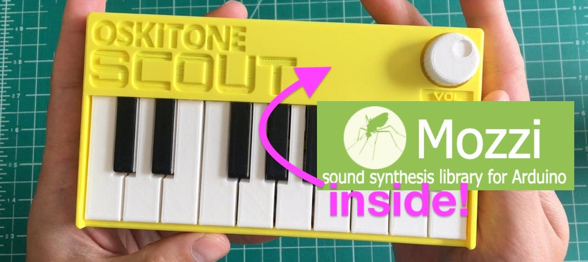

# MozziScout

Arduino sketches for Oskitone Scout using Mozzi synthesis library!



[Mozzi](https://sensorium.github.io/Mozzi/) is an audio synthesis library for Arduino
that can do multi-oscillator synthesis with filters and modulation on even an Arduino Uno.

[Oskitone Scout](https://www.oskitone.com/product/scout-synth-diy-electronics-kit)
is an adorable tiny keyboard kit, based on an Arduino Uno and entirely open source.

This repo shows some examples of using Mozzi on Scout, along with the small mod needed to make it work.

## Table of contents

* [Sketches](#sketches)
* [Demos](#demos)
* [How to mod your Scout](#how-to-mod-your-scout)
* [Using normal Scout code](#using-normal-scout-code)
* [How to install Mozzi](#how-to-install-mozzi)
* [Using Mozzi](#using-mozzi)
* [Any questions?](#any-questions)


## Sketches

- [mozziscout](mozziscout/) - a straight-forward Mozzi version of the '[scout](https://github.com/oskitone/scout/blob/main/arduino/scout/scout.ino)' sketch that comes on Scout

- [mozziscout_monosynth1](mozziscout_monosynth1/) - a fat mono synth, made of two detuned oscillators
and a single resonant low-pass filter.  Also features different startup modes to tune synth paramters.
(see sketch for details)

- [mozziscout_drums_bass](mozziscout_drums_bass/) - a 4-voice drum sample kit (bd,sd,oh,ch) and a single oscillator synth in one!

- [mozziscout_poly](mozziscout_poly/) - a poly synth, sort of. Scout's keyboards doesn't allow true
playing of chords, but with a slow release envelope and the playing of arpeggios, you can make chords

- [mozziscout_wash](mozziscout_wash/) - a five-oscillator stacked chord sound based on the Mozzi example
[Control_Oscil_Wash](https://github.com/sensorium/Mozzi/blob/master/examples/02.Control/Control_Oscil_Wash/Control_Oscil_Wash.ino)

- [mozziscout_thx](mozziscout_thx/) - an eight-oscillator stacked sound where the oscillators start at a random pitch and slowly converge to a chord. Vagugely based on [THX Deep Note](https://en.wikipedia.org/wiki/Deep_Note)


## Demos

* "mozziscout_monosynth1" - Phat two-oscillator monosynth
  <video controls src="https://user-images.githubusercontent.com/274093/146259658-660f73e4-ada4-4644-8b9a-44deefcc8644.mp4"></video>

* "mozziscout_poly" - Turn Scout into a polyphonic synth, sort of
  <video controls src="https://user-images.githubusercontent.com/274093/145933351-45c38eea-6b29-4ec0-b800-44b9021e631d.mp4"></video>

* "mozziscout_thx" - Make your Scout do THX Deep Note, sort of
  <video controls src="https://user-images.githubusercontent.com/274093/145933155-d71aab6e-c19b-4d4a-ba7b-1610026e639d.mp4"></video>  


## How to mod your Scout

MozziScout is just like a normal Scout, but pins 9 & 11 are swapped, so we can use Mozzi.
The Mozzi library uses pin 9 for audio, because that's on Timer1, a 16-bit timer.
However Scout uses the 8-bit Timer2 on pin 9. It's not easy to swap these two functions in code.

So to make Scout work with Mozzi, swap the functions of pins 9 & 11 physically!
Pin 9 is normally hooked up to the keyboard. Pin 11 is normally the audio out.
Arduino pins 9 & 11 are ATmega328 pins 15 & 17. (Pin 15  is thebottom-right pin if looking down on it, and Pin 17 is two up from that)

One way two swap this is where the two legs of the ATmega328 chip are lifted,
and jumper wires are soldered on and plugged into the socket, as in the photo below.


## Using normal Scout code

After this mod, you can still use your Scout like normal, just make sure to swap pins 9 & 11 in the code.

- In [scout/scout.ino](https://github.com/oskitone/scout/blob/main/arduino/scout/scout.ino) change:

```c++
const int SPEAKER_PIN = 9;  // was 11
```

- In [scout/KeyBuffer.cpp](https://github.com/oskitone/scout/blob/main/arduino/scout/KeyBuffer.cpp) change:

```c++
byte rowPins[ROWS] = {7, 8, 11, 10};  // was {7, 8, 9, 10}
```


## How to install Mozzi

Mozzi is not in the Arduino Library Manager, but installing it is pretty easy anyway.
The installation process is the same way you hand-install any Arduino library.

- Go to https://github.com/sensorium/Mozzi and click on the green "Code" button,
then click "Download ZIP".
- You will get a "Mozzi-master.zip" file. Rename it to "Mozzi.zip"
- In the Arduino IDE, go to "Sketch" -> "Include Library" -> "Install .ZIP library...", then pick your "Mozzi.zip" file.
- Once it completes, you will see Mozzi in the list of available libraries and the Mozzi examples
in "File" -> "Examples" -> "Mozzi".  Many of the examples will work with Scout but not use the keyboard.


## Using Mozzi

- Mozzi is very particular about what is in `loop()`. Do not put anything else in there.
  Instead put it in the `void updateControl()` function. See the sketches for examples.
- Mozzi output is quieter than standard Scout (which outputs full-width square waves).
  Use an external amp for best results.

## Any questions?

Open up an issue on this repo or contact me on [twitter/@todbot](https://twitter.com/todbot)!
